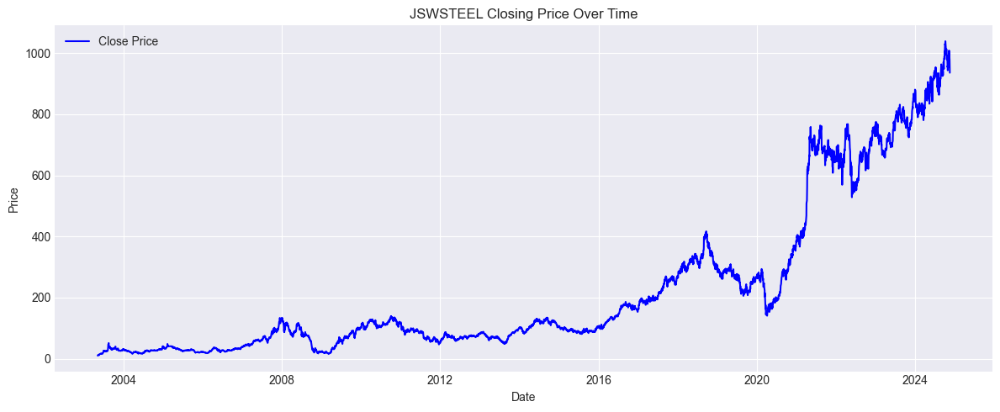
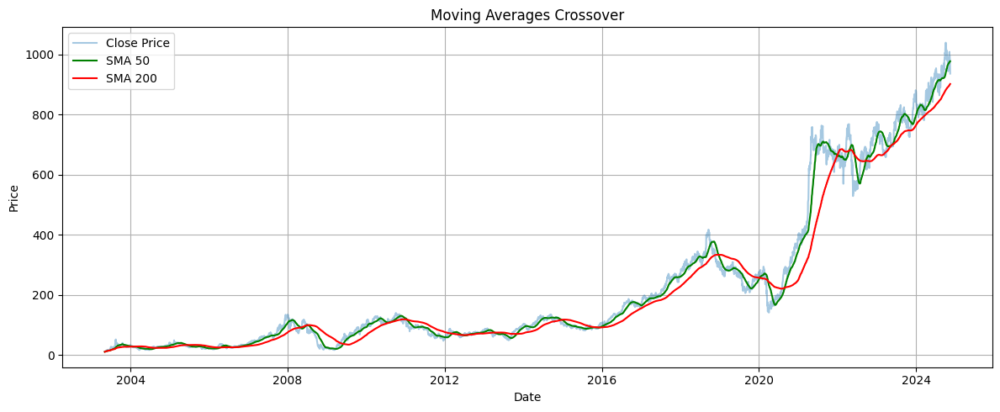
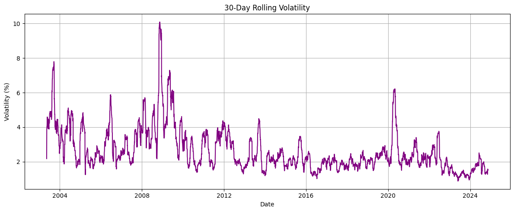

# 📊 JSW Steel Stock Price Analysis

A comprehensive data analysis project that dives deep into the stock price movements and technical indicators of **JSW Steel**, using Python and various data science libraries. This notebook showcases insights through visualization, trend detection, and technical indicators.

---

## 🧠 Project Description

This project involves analyzing historical stock data of JSW Steel to uncover trends and patterns in the stock's behavior. The aim is to provide both a statistical and visual understanding of how the stock has performed over time and what indicators like Moving Averages and RSI suggest about its movements.

---
## 🚀 Features

- Interactive time-series analysis
- Candlestick plotting using Plotly
- Moving Averages (SMA/EMA)
- RSI (Relative Strength Index) calculation
- Bollinger Bands and trend spotting
- Clear visual interpretation using Matplotlib and Seaborn

---

## 🛠️ Technologies Used

- Python
- Pandas & NumPy
- Matplotlib & Seaborn
- Plotly
- yfinance (Yahoo Finance API)
- Jupyter Notebook

---

## 📈 Project Insights

- **Stock Trends:** Analysis shows key resistance and support levels based on SMA and EMA trends.
- **Volatility:** Bollinger Bands indicate periods of high and low volatility.
- **Momentum:** RSI reveals overbought and oversold zones, providing potential buy/sell signals.
- **Price Movement:** Volume spikes often precede large price shifts, as observed in multiple regions of the time series.

---

## 🖼️ Visual Snapshots

### 🔹 Closing Price vs Time

### 🔹 Moving Over Crossover

### 🔹 30 Days Rolling Volatility

---

